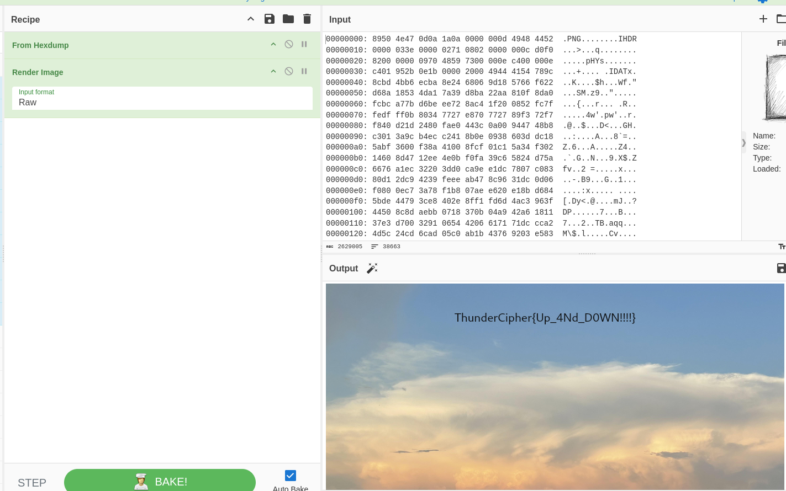

We had a file that had a PNG hex format but the lines are upside down.

I wrote a script to reverse the whole file.

```python
def reverse_file_lines(input_file, output_file):
    with open(input_file, 'r') as file:
        lines = file.readlines()
    
    reversed_lines = lines[::-1]
    
    with open(output_file, 'w') as file:
        file.writelines(reversed_lines)

# Usage
input_file = 'input.txt'  # Replace with the path to your input file
output_file = 'output.txt'  # Replace with the path to your desired output file

reverse_file_lines(input_file, output_file)
```

And added the output.txt in `CyberChef`.

<figure></figure>

Flag:
```
ThunderCipher{Up_4Nd_D0WN!!!!}
```