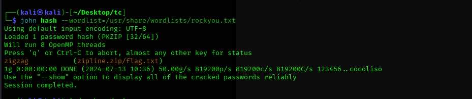
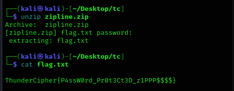

The zip had a password so I used `zip2john` to crack the password of the zip.

<figure></figure>

Got the flag after extracting the zip file.

<figure></figure>

Flag:
```
ThunderCipher{P4ssW0rd_Pr0t3Ct3D_z1PPP$$$$}
```