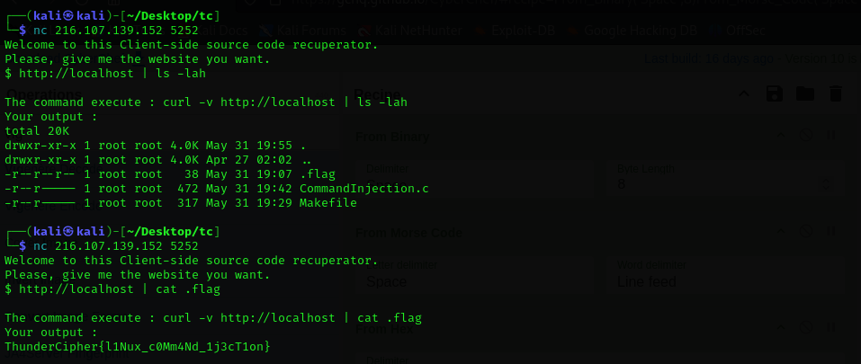

**Username**
```
ThunderCipher{whoami}
```

**Binary**
```
ThunderCipher{which}
```

**Connections**
```
ThunderCipher{netstat}
```

**Track**
```
ThunderCipher{traceroute}
```

**Where am i**
```
ThunderCipher{pwd}
```

**OS**
```
ThunderCipher{cat /etc/os-release}
```

**Password**
```
ThunderCipher{passwd}
```

**Password**
```
ThunderCipher{passwd}
```

**New user**
```
ThunderCipher{adduser}
```

**New group**
```
ThunderCipher{groupadd}
```

**Remove User**
```
ThunderCipher{deluser}
```

**Remove Group**
```
ThunderCipher{delgroup}
```

**PCI**
```
ThunderCipher{lspci}
```

**Assist**
```
ThunderCipher{man}
```

**Memory**
```
ThunderCipher{free}
```

**Kernel**
```
ThunderCipher{uname -r}
```

**Topology**
```
ThunderCipher{lstopo}
```

**USB**
```
ThunderCipher{lsusb}
```

**Hardware**
```
ThunderCipher{lshw}
```

**Disk**
```
ThunderCipher{lsblk}
```

**Space**
```
ThunderCipher{df}
```

**Mounted**
```
ThunderCipher{mount}
```

**Change**
```
ThunderCipher{chmod}
```

**Attribute**
```
ThunderCipher{chattr}
```

**Pipes**
<figure></figure>
```
ThunderCipher{l1Nux_c0Mm4Nd_1j3cT1on}
```