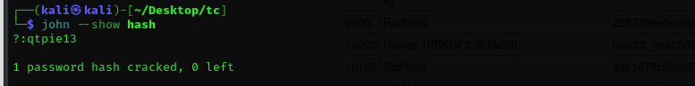
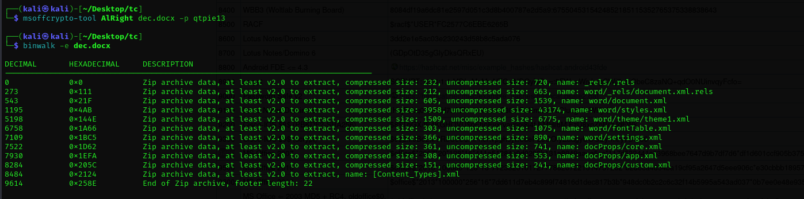
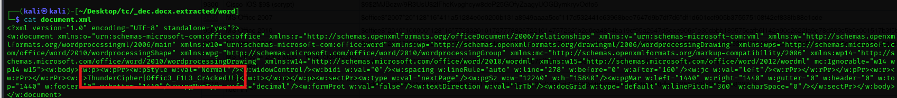

Generated a hash using `office2john` and cracked using `rockyou.txt`.

```bash
office2john AlRight > hash
john hash --wordlist=rockyou.txt
john --show hash
```

<figure></figure>

Using the `msoffcrypto-tool`, I can decrypt the file to a doc.

<figure></figure>

Found the flag in `word/document.xml`.

<figure></figure>

Flag:
```
ThunderCipher{Offic3_F1L3_Cr4cked!!}
```