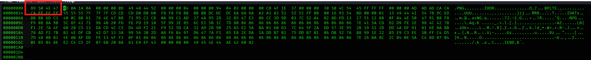

I had a file of which hex structure was damaged. I changed the hex to the png header.

<figure></figure>

I got the flag when I opened the image.

<figure></figure>


Flag:
```
ThunderCipher{fixing_images_is_fun}
```