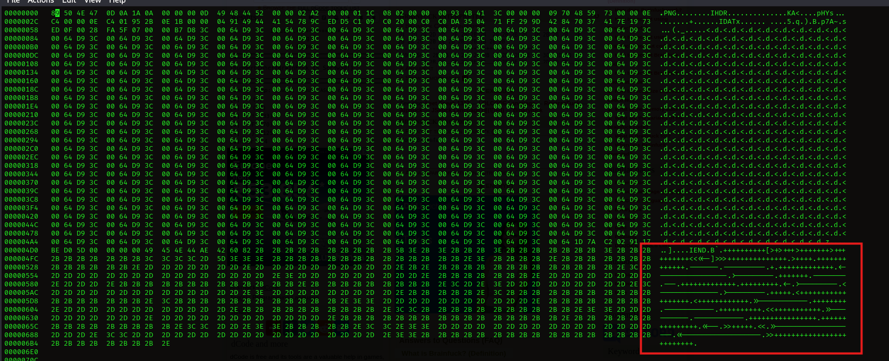
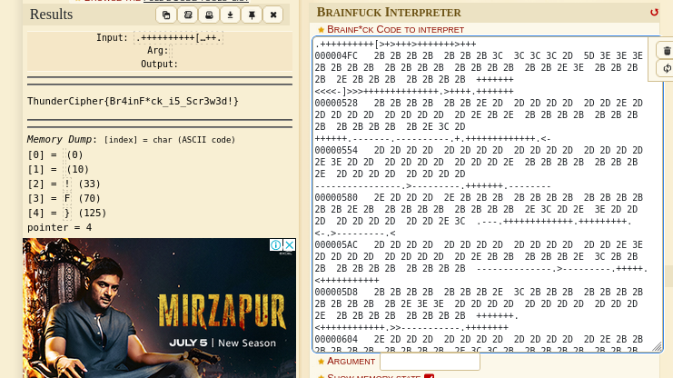

On opening the HEX of the image I found some text.

<figure></figure>

Translated that to `Brainfuck Language` and got the flag.

<figure></figure>


Flag: 
```
ThunderCipher{Br4inF*ck_i5_Scr3w3d!}
```