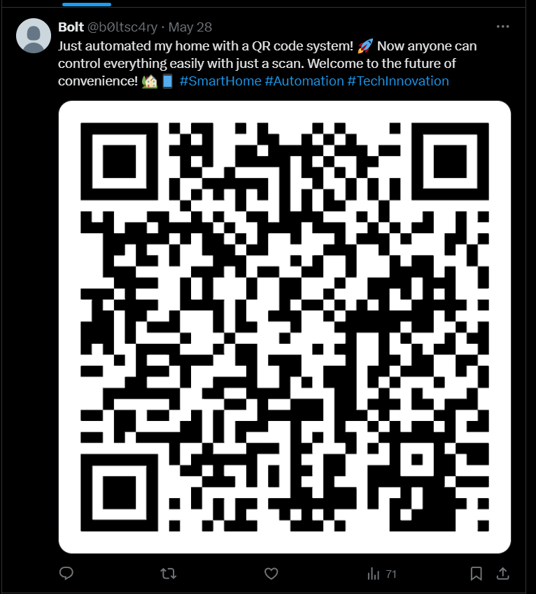

**Description**: It was a cold, rainy evening when cybersecurity analyst Alex received a mysterious message. The subject line read: "Can you find me?" Intrigued, Alex opened the email to find a single clue: a username- **sc4ryb0lt**

Found a user on `Github` using the same username.

https://github.com/sc4ryb0lt/portfolio/blob/main/index.html

This leaded to a [twitter](https://x.com/b0ltsc4ry) account.

<figure></figure>

On Scanning the qr code, Got the following text.

```
WIFI:S:ThunderCipher{FAKE_FLAG};T:nopass;P:ThunderCipher{P4SSw0rd_1S_Sc4ry!!};;
```

Flag:
```
ThunderCipher{P4SSw0rd_1S_Sc4ry!!}
```