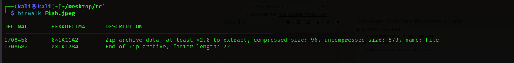

Extracted some files from the image using binwalk.

<figure></figure>

Got a text file with whitespace and used `whitespace language` to decode and got the flag.

Flag:
```
ThunderCipher{C4n_Y0u_W4lK_m3_Thr0ugh}
```