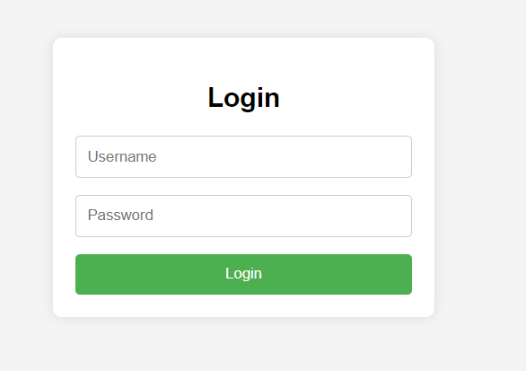
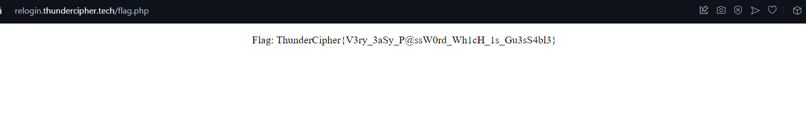

We get a regular looking login page.

<figure></figure>

On trying some common credentials, I was able to get the flag.

```
admin
password123
```
<figure></figure>

Flag:
```
ThunderCipher{V3ry_3aSy_P@ssW0rd_Wh1cH_1s_Gu3sS4bl3}
```